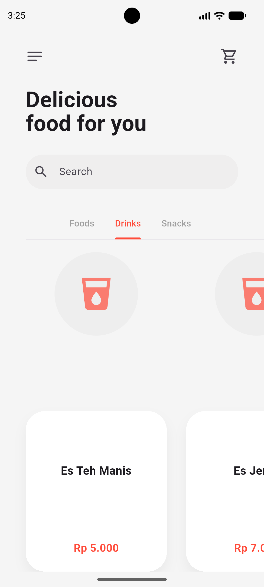
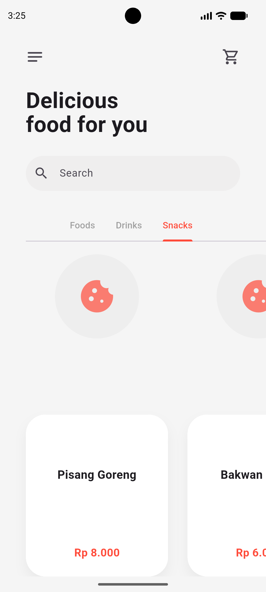
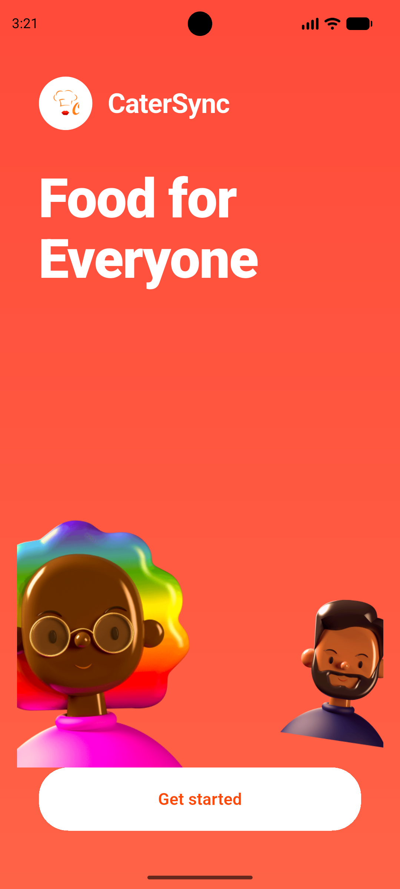
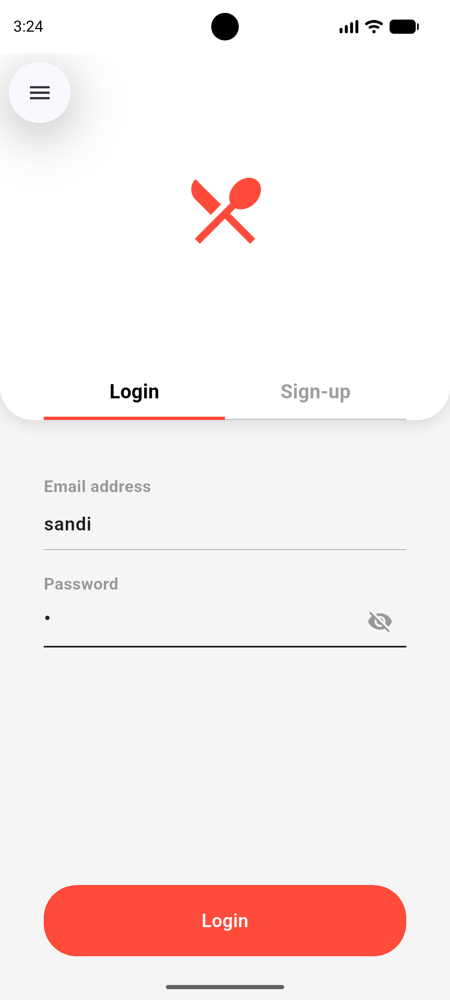
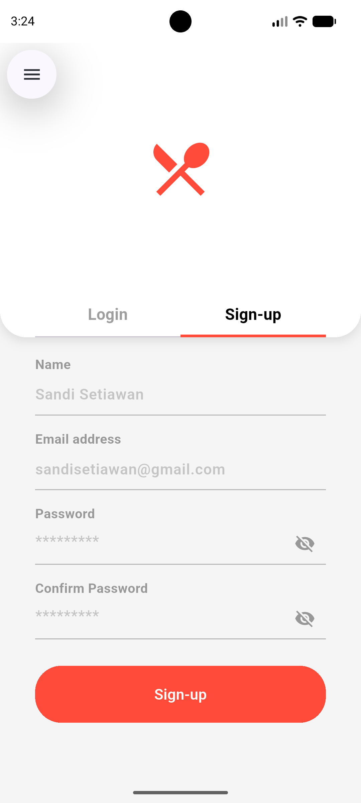
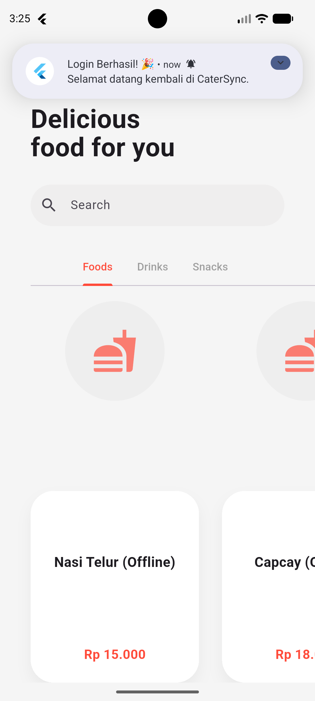
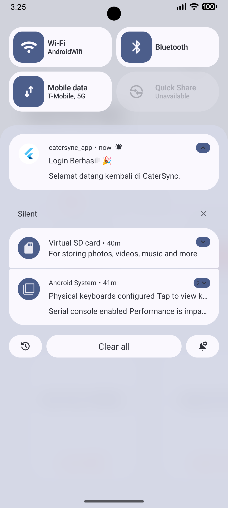
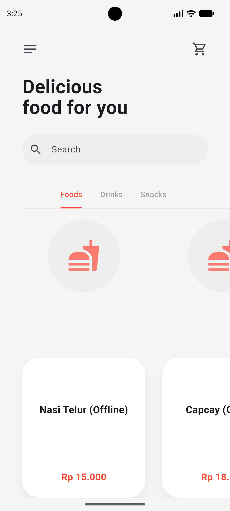

# CaterSync Mobile App

**Status**: Prototype / Tugas Pemrograman Mobile Flutter  
**Platform**: Android, Web, dan dapat dikembangkan ke iOS/Windows  
**Teknologi**: Flutter + Dart + Provider + Shared Preferences + REST API + Local Notification

**Link Design FIGMA** : https://www.figma.com/design/UzJBe6hE72xs9T1tGsMR9q/CaterSync--Catering-Food-Delivery-Mobile-App-?node-id=0-1&t=XvHyZLX9RryX98bO-1

---

## 1. Pendahuluan

CaterSync Mobile App adalah aplikasi mobile sederhana yang dibuat sebagai bentuk implementasi tugas pemrograman mobile menggunakan Flutter. Aplikasi ini menampilkan alur pengguna yang sederhana, mulai dari onboarding, login/sign-up, hingga halaman home yang menampilkan daftar menu makanan.

Tujuan dari pembuatan aplikasi ini adalah untuk menerapkan beberapa konsep penting dalam pengembangan aplikasi mobile, seperti:
- penggunaan framework Flutter,
- penerapan state management dengan Provider,
- integrasi REST API untuk menampilkan data list,
- penyimpanan data lokal menggunakan Shared Preferences,
- serta implementasi fitur perangkat berupa local notification.

---

## 2. Tujuan Project

Project ini dibuat untuk memenuhi beberapa kebutuhan tugas, yaitu:
1. Membangun aplikasi mobile menggunakan Flutter.
2. Menggunakan arsitektur sederhana yang terstruktur dan mudah dipahami.
3. Menerapkan state management dengan Provider.
4. Mengintegrasikan data dari API.
5. Menyimpan status login secara lokal.
6. Menambahkan fitur notifikasi lokal.
7. Menyimpan hasil pekerjaan pada repository GitHub.

---

## 3. Fitur yang Sudah Diimplementasikan

### 3.1 Onboarding
- Halaman pembuka yang memperkenalkan aplikasi.
- Terdapat branding CaterSync dan tombol untuk melanjutkan ke halaman login.

### 3.2 Login dan Sign-up
- Terdapat form login dan form sign-up dalam satu layar.
- Pengguna dapat memasukkan email dan password.
- Terdapat toggle untuk melihat atau menyembunyikan password.
- Setelah login atau sign-up berhasil, pengguna diarahkan ke halaman home.

### 3.3 Home Screen
- Menampilkan halaman utama aplikasi.
- Terdapat kategori menu seperti Foods, Drinks, dan Snacks.
- Menggunakan data dari API untuk menampilkan daftar makanan.
- Menyediakan tampilan kartu menu yang menarik dan rapi.

### 3.4 Integrasi REST API
- Aplikasi mengambil data list makanan dari API publik.
- Data yang diterima kemudian ditampilkan di layar home.
- Jika API tidak tersedia, aplikasi tetap dapat menampilkan data cadangan.

### 3.5 Local Storage
- Status login disimpan menggunakan Shared Preferences.
- Jika pengguna sudah login sebelumnya, aplikasi langsung masuk ke halaman home.

### 3.6 Local Notification
- Aplikasi memberikan notifikasi lokal saat login atau pendaftaran berhasil.
- Fitur ini menunjukkan bahwa aplikasi telah mengimplementasikan fitur perangkat mobile.

---

## 4. Teknologi yang Digunakan

- Flutter
- Dart
- Provider
- Shared Preferences
- HTTP
- Flutter Local Notifications
- Material Design

---

## 5. Struktur Project

```text
catersync_app/
├── android/
├── ios/
├── lib/
│   ├── main.dart
│   ├── models/
│   │   └── food_model.dart
│   ├── providers/
│   │   ├── api_provider.dart
│   │   └── auth_provider.dart
│   ├── screen/
│   │   ├── onboarding_screen.dart
│   │   ├── login_screen.dart
│   │   └── home_screen.dart
│   └── services/
│       └── notification_service.dart
├── test/
├── pubspec.yaml
└── README.md
```

Penjelasan singkat:
- folder models berisi model data.
- folder providers digunakan untuk mengelola state aplikasi.
- folder screen berisi tampilan halaman aplikasi.
- folder services berisi logika notifikasi.

---

## 6. Penjelasan Sesuai Kriteria Tugas

### 6.1 Implementasi Flutter
Aplikasi dibangun menggunakan Flutter sebagai framework utama untuk membuat antarmuka mobile yang modern dan responsif.

### 6.2 Penerapan Software Architecture
Project ini menggunakan pendekatan terstruktur dengan pemisahan antara:
- tampilan (screen),
- logika state (provider),
- model data (models),
- dan layanan tambahan (services).

Walaupun masih sederhana, pendekatan ini sudah sesuai dengan prinsip pemisahan tanggung jawab dan memudahkan pengembangan lebih lanjut.

### 6.3 State Management
State Management diterapkan menggunakan Provider. Provider digunakan untuk mengatur status loading, status login, serta data yang diambil dari API.

### 6.4 Integrasi API
Aplikasi menggunakan API publik untuk mengambil data list makanan. Proses ini dilakukan di provider dan hasilnya ditampilkan di halaman home.

### 6.5 Local Storage
Shared Preferences digunakan untuk menyimpan status login pengguna. Dengan fitur ini, aplikasi dapat mengingat apakah pengguna sudah login atau belum.

### 6.6 Fitur Perangkat (Mobile Feature)
Fitur local notification telah diimplementasikan sebagai fitur perangkat mobile. Notifikasi muncul saat pengguna berhasil login atau melakukan pendaftaran.

### 6.7 Repository GitHub
Hasil pekerjaan ini disimpan dan dikelola dalam repository GitHub agar mudah dibagikan dan dipelihara.

---

## 7. Cara Menjalankan Aplikasi

### 7.1 Persiapan
Pastikan Flutter sudah terinstall di komputer Anda.

```bash
flutter doctor
```

### 7.2 Install Dependency
```bash
cd d:\catersync_app
flutter pub get
```

### 7.3 Jalankan di Chrome/Web
```bash
flutter run -d chrome
```

### 7.4 Jalankan di Emulator Android
```bash
flutter run
```

### 7.5 Build APK
```bash
flutter build apk
```

---


<<<<<<< HEAD
Berikut beberapa dokumentasi visual hasil running aplikasi CaterSync yang disusun secara berurutan sesuai alur penggunaan aplikasi.

### 8.1 Tampilan onboarding dan autentikasi







### 8.2 Halaman home dan daftar menu






### 8.3 Notifikasi dan hasil running aplikasi








---

## 9. Kelebihan Aplikasi
=======
## 8. Kelebihan Aplikasi
>>>>>>> d352a761ce7b06ce37b86a838667ed38a1053f7b

- Tampilan sederhana namun menarik.
- Alur aplikasi mudah dipahami.
- Sudah menerapkan berbagai konsep penting Flutter.

---

## 9. Kekurangan dan Pengembangan Selanjutnya

Beberapa bagian masih bisa dikembangkan lebih lanjut, misalnya:
- autentikasi backend yang sebenarnya,
- database pengguna,
- fitur keranjang belanja,
- fitur pembayaran,
- dan integrasi notifikasi push.

---

## 10. Penutup

Project ini dibuat sebagai bagian dari pembelajaran pengembangan aplikasi mobile menggunakan Flutter. Melalui project ini, memahami bagaimana menghubungkan UI, state management, API, local storage, dan fitur perangkat dalam satu aplikasi yang utuh.

Semoga aplikasi ini dapat menjadi dasar yang baik untuk pengembangan project Flutter yang lebih kompleks di kemudian hari.

---

**Nama Project**: CaterSync Mobile App  
**Tanggal Dokumentasi**: 4 Juli 2026  
**Versi Flutter**: 3.12 / sesuai environment yang digunakan

         